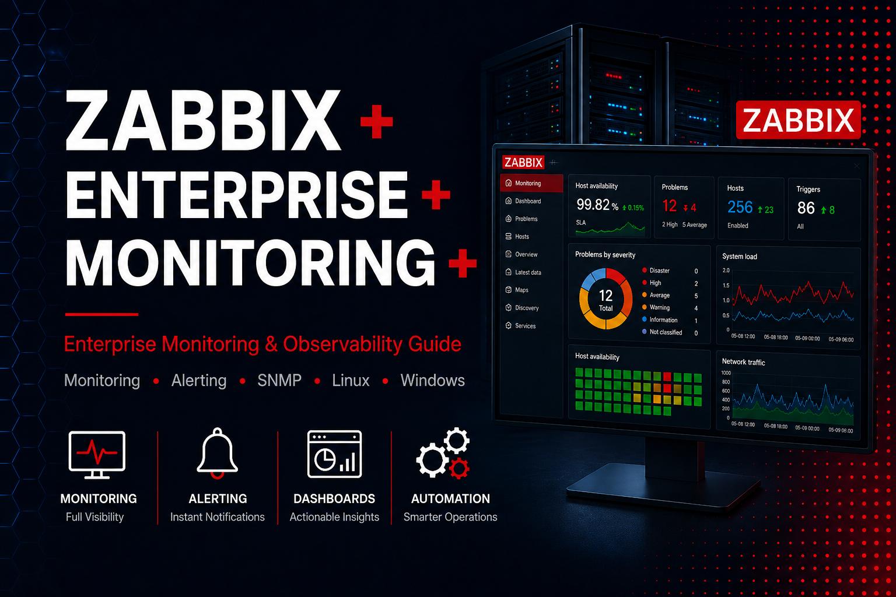

  

<h1 align="center">Zabbix Enterprise Monitoring Guide</h1>

Enterprise Zabbix monitoring guide covering architecture, templates, SNMP, agents, alerting, dashboards, automation, security and operational best practices.

🌐 <strong><a href="https://sarabelinformatika.hu">Official Website</a></strong> •
📝 <strong><a href="https://sarabelinformatika.hu/blog">Technical Blog</a></strong>

---

# Overview

Modern organizations depend on increasingly complex IT infrastructures consisting of servers, network devices, virtualization platforms, storage systems, applications, cloud services and remote connectivity.

Without centralized monitoring, administrators often become aware of operational problems only after users report service degradation or business processes have already been affected.

Zabbix provides a comprehensive open-source platform for monitoring the availability, performance and health of enterprise infrastructure from a centralized location.

This guide focuses on the architectural principles, operational practices and monitoring strategies required to build reliable and maintainable Zabbix environments.

Rather than concentrating on isolated configuration examples, it explains how monitoring should support business continuity, operational visibility, capacity planning and proactive incident prevention.

---

# What You Will Learn

This guide covers the complete lifecycle of an enterprise Zabbix deployment, including:

- Monitoring architecture
- Installation planning
- Host organization
- Template design
- SNMP monitoring
- Agent-based monitoring
- Web service monitoring
- Dashboard design
- Alerting strategy
- Infrastructure discovery
- Security hardening
- Maintenance
- Troubleshooting
- Enterprise monitoring reviews

---

# Table of Contents

| Chapter | Topic |
|---|---|
| 01 | [Introduction](docs/01-introduction.md) |
| 02 | [Monitoring Architecture](docs/02-monitoring-architecture.md) |
| 03 | [Installation](docs/03-installation.md) |
| 04 | [Host Management](docs/04-host-management.md) |
| 05 | [Templates](docs/05-templates.md) |
| 06 | [SNMP Monitoring](docs/06-snmp-monitoring.md) |
| 07 | [Agent Monitoring](docs/07-agent-monitoring.md) |
| 08 | [Web Monitoring](docs/08-web-monitoring.md) |
| 09 | [Dashboards](docs/09-dashboards.md) |
| 10 | [Alerting](docs/10-alerting.md) |
| 11 | [Discovery](docs/11-discovery.md) |
| 12 | [Security](docs/12-security.md) |
| 13 | [Maintenance](docs/13-maintenance.md) |
| 14 | [Troubleshooting](docs/14-troubleshooting.md) |
| 15 | [Enterprise Checklist](docs/15-enterprise-checklist.md) |

---

# Who Is This Guide For?

This documentation is intended for:

- System administrators
- Network engineers
- Monitoring specialists
- IT consultants
- Managed service providers
- Infrastructure architects
- Enterprise IT teams
- Small and medium-sized businesses

A basic understanding of networks, operating systems and infrastructure management is recommended.

---

# Guiding Principles

The recommendations throughout this guide are based on several consistent principles:

- Monitoring should reflect business priorities.
- Visibility should extend across the complete infrastructure.
- Alerts should be relevant and actionable.
- Templates should promote standardization.
- Monitoring systems should remain secure and maintainable.
- Historical data should support capacity planning.
- Documentation should evolve with the environment.
- Monitoring should enable proactive operations.

These principles apply regardless of infrastructure size or complexity.

---

# Monitoring as an Operational Discipline

Monitoring is not simply the collection of technical metrics.

An effective enterprise monitoring platform should help administrators answer questions such as:

- Are critical business services available?
- Is infrastructure performance degrading?
- Are storage or resource limits approaching?
- Have authentication or network patterns changed?
- Are backup systems functioning correctly?
- Which systems require immediate intervention?
- What trends may affect future capacity?

The objective is not to collect the largest possible amount of data.

The objective is to collect meaningful information that supports informed operational decisions.

---

# Why This Guide Exists

Many Zabbix resources focus on installation steps, individual items or isolated configuration examples.

Although these resources are useful, they often provide limited guidance on designing a complete enterprise monitoring strategy.

This guide emphasizes:

- architecture before configuration;
- standardization before uncontrolled expansion;
- actionable alerting instead of notification overload;
- long-term operational value instead of short-term deployment;
- visibility across systems rather than isolated device monitoring.

The goal is to help organizations build monitoring environments that remain reliable, scalable and manageable throughout their lifecycle.

---

# Scope

This guide covers enterprise monitoring concepts and operational best practices related to:

- physical and virtual servers;
- Linux and Windows systems;
- network infrastructure;
- virtualization platforms;
- storage systems;
- applications;
- websites and services;
- SNMP-compatible devices;
- agent-based telemetry;
- dashboards and reporting;
- alerting and escalation.

Configuration examples are intentionally minimized so that the underlying principles remain applicable across future Zabbix releases.

---

# Enterprise Infrastructure Series

This repository is part of the **SARABEL Informatika Enterprise Infrastructure Series**.

## Available

- [MikroTik Security Hardening Guide](https://github.com/sarabelinformatika/mikrotik-security-hardening)
- [MikroTik VPN Guide](https://github.com/sarabelinformatika/mikrotik-vpn-guide)
- [PrivacyIDEA + FreeRADIUS + MikroTik OpenVPN](https://github.com/sarabelinformatika/privacyidea-freeradius-mikrotik-openvpn)
- [Proxmox VE Enterprise Guide](https://github.com/sarabelinformatika/proxmox-ve-enterprise-guide)

## In Development

- Zabbix Enterprise Monitoring Guide

## Planned

- Docker Infrastructure Guide
- Nextcloud Enterprise Guide
- Windows Server Security Guide
- Synology Enterprise Guide
- Backup and Disaster Recovery Guide

---

# Contributing

Suggestions, corrections and constructive technical feedback are welcome.

Contributions may include:

- technical corrections;
- documentation improvements;
- clarification of existing recommendations;
- updated monitoring practices;
- additional enterprise considerations.

Please review [CONTRIBUTING.md](CONTRIBUTING.md) before opening a Pull Request.

---

# Related Resources

## Company

- 🌐 **Official Website**  
  https://sarabelinformatika.hu

- 📝 **Technical Blog**  
  https://sarabelinformatika.hu/blog

## Featured Articles

- **Why Continuous Server and Network Monitoring Matters**  
  https://sarabelinformatika.hu/blog/miert-fontos-a-folyamatos-szerver-es-halozati-monitoring-igy-elozhetok-meg-a-varatlan-rendszerleallasok

- **Why Server Failures Often Go Undetected – Lessons from a Monitoring Project**  
  https://sarabelinformatika.hu/blog/miert-nem-vettek-eszre-idoben-a-szerverhibakat-egy-monitoring-projekt-tanulsagai

## Enterprise Infrastructure Series

- MikroTik Security Hardening Guide  
  https://github.com/sarabelinformatika/mikrotik-security-hardening

- MikroTik VPN Guide  
  https://github.com/sarabelinformatika/mikrotik-vpn-guide

- PrivacyIDEA + FreeRADIUS + MikroTik OpenVPN  
  https://github.com/sarabelinformatika/privacyidea-freeradius-mikrotik-openvpn

- Proxmox VE Enterprise Guide  
  https://github.com/sarabelinformatika/proxmox-ve-enterprise-guide

---

# Security

Potentially unsafe or inaccurate security recommendations should be reported according to the process described in [SECURITY.md](SECURITY.md).

---

# Disclaimer

This documentation is provided for educational and informational purposes.

Every infrastructure environment is different. Recommendations should be evaluated according to organizational requirements, operational risks and applicable regulations.

See [DISCLAIMER.md](DISCLAIMER.md) for details.

---

# License

This project is released under the [MIT License](LICENSE).

---

## SARABEL Informatika Kft.

Enterprise Infrastructure • Monitoring • Open Source • Documentation

🌐 <a href="https://sarabelinformatika.hu">sarabelinformatika.hu</a>

📝 <a href="https://sarabelinformatika.hu/blog">Technical Blog</a>

